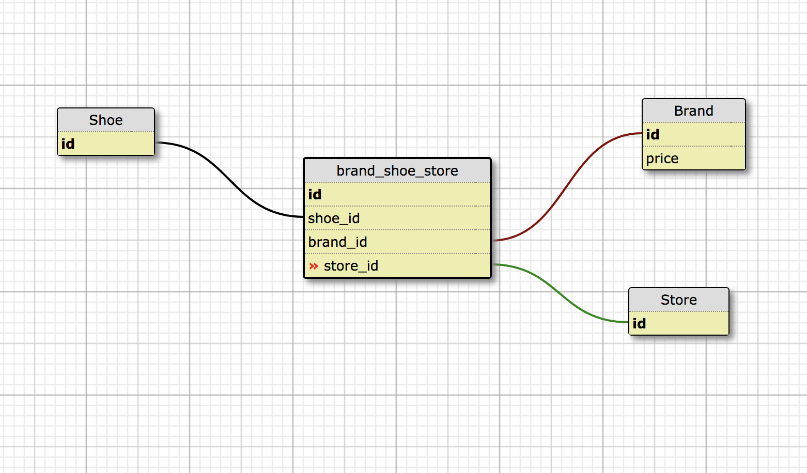

# Shoe Company

###### Epicodus: Ruby Independent Project 07/20/2018
###### By Nicholas Brown

## Description

 A web application that tracks both shoes and their brands

## Design

Shoes will belong to many brands and a brand can belong to shoes (many to many).

Webpage's Schema
 my initial schema setup was


I changed my design to


## Specifications
* _1 view list of shoes
  - _Example Input: _
  - _Example Output: _
* _2 add a shoe to the shoe list
  - _Example Input: _
  - _Example Output: _
* _3 update a shoe to the shoe list
  - _Example Input: _
  - _Example Output: _
* _3 delete a shoe from the shoe list
  - _Example Input: _
  - _Example Output: _
* _3 view list of shoe brands
  - _Example Input: _
  - _Example Output: _
* _3 add a shoe brand with its price to the shoe brand list
  - _Example Input: _
  - _Example Output: _
* _3 add a shoe brand to a store
  - _Example Input: _
  - _Example Output: _
* _3 add a specific shoe brand to multiple stores
  - _Example Input: _
  - _Example Output: _
* _3 view all of the brands that a store has on one webpage.
  - _Example Input: _
  - _Example Output: _
* _3 validation- store names and shoe brands to be saved with a capital letter regardless of entry
  - _Example Input: _
  - _Example Output: _
* _3 validation- A shoe's listed price will be displayed in currency format
  - _Example Input: _
  - _Example Output: _
* _3 validation- stores and shoe brands to be saved the entered value is blank
  - _Example Input: _
  - _Example Output: _
* _3 validation-  A stores and brands are unique; any brand or stores will not be saved if the name already saved
  - _Example Input: _
  - _Example Output: _
* _3 validation-  Store and brand names to have a maximum of one hundred characters.
  - _Example Input: _
  - _Example Output: _

## Setup/Contribution Requirements

1. Clone the repo
```
git clone <website>
```
1. bundle Gems
```
$bundle install
```
1. database
```
rake db:create
rake db:migrate
```
1. host app locally
```
$ruby app.rb
```
1. insert localhost with <port number> given in terminal into a webpage's URL
```
localhost:<port number>      ---example--- localhost:4567
```

## Technologies Used

* Ruby 2.4.1

### License

*{This software is licensed under the MIT license}*

Copyright (c) 2018 **_  Nick Brown  _**
