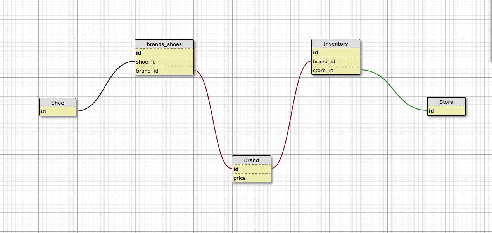
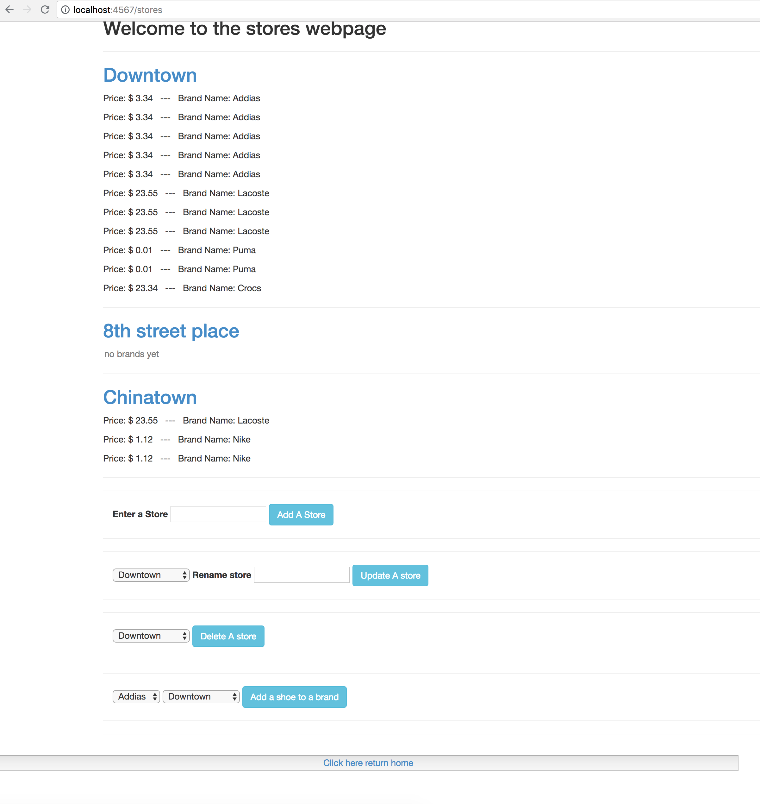
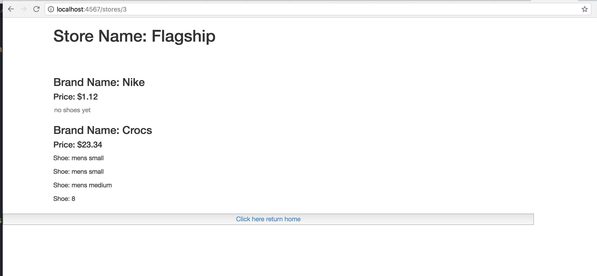

# Shoe Company

###### Epicodus: Ruby Independent Project 07/20/2018
###### By Nicholas Brown

## Description

 A web application that tracks both shoes and their brands. A user can input a shoe type (like "small" "medium" or "large") and link those those to a brand. The brands can then be linked to a store. Finally, by clicking on a store link the store name will appear on a webpage with all of its connected brands and shoes.

## Design

Shoes will belong to many brands and a brand can belong to shoes (many to many).

Webpage's Schema


Store webpage design



Store webpage link




Brand page


## Specifications
* _1 view list of shoes
  - _Example Input: _ Click here to view and add shoes  
  - _Example Output: _ "small", "medium"
* _2 add a shoe to the shoe list
  - _Example Input: _ "large"
  - _Example Output: _"small", "medium", "large"
* _3 update a shoe to the shoe list
  - _Example Input: _select: large input "Xlarge"
  - _Example Output: _"small", "medium", "Xlarge"
* _3 delete a shoe from the shoe list
  - _Example Input: _ Xlarge
  - _Example Output: _"small", "medium"
* _3 view list of shoe brands
  - _Example Input: _ Click here to view and add brands  
  - _Example Output: _ "Nike", "Crocs"
* _3 add a shoe brand with its price to the shoe brand list
  - _Example Input: _ "Puma"
  - _Example Output: _"Nike", "Crocs", "Puma"
* _3 add a shoe brand to a store
  - _Example Input: _"Puma" : "Downtown"
  - _Example Output: _ "Downtown: Brands: "Crocs", "Puma"
* _3 add a specific shoe brand to multiple stores
  - _Example Input: _"Puma" : "Chinatown"
  - _Example Output: _"Chinatown: Brands: "Puma",
* _3 view all of the brands that a store has on one webpage.
  - _Example Input: _ Click here to view stores and add,update or delete them  
  - _Example Output: _ "Downtown", "Chinatown", "9th Street"
* _3 validation- shoe brands to be saved with a capital letter regardless of entry
  - _Example Input: _ puma
  - _Example Output: _Puma
* _3 validation- A shoe's listed price will be displayed in currency format
  - _Example Input: _ Puma, 18.45
  - _Example Output: _Puma Price $18.45
* _3 validation- stores and shoe brands to be saved the entered value is blank
  - _Example Input: _""
  - _Example Output: _<no "" named brand displayed on webpage>
* _3 validation-  A stores and brands are unique; any brand or stores will not be saved if the name already saved
  - _Example Input: _ Puma
  - _Example Output: _"Nike", "Crocs", "Puma"
* _3 validation-  Store and brand names to have a maximum of one hundred characters.
  - _Example Input: _ aaa*(100)
  - _Example Output: _ <no "" named brand displayed on webpage>

## Setup/Contribution Requirements

1. Clone the repo
```
git clone <website>
```
1. bundle Gems
```
$bundle install
```
1. database
```
rake db:create
rake db:migrate
```
1. host app locally
```
$ruby app.rb
```
1. insert localhost with <port number> given in terminal into a webpage's URL
```
localhost:<port number>      ---example--- localhost:4567
```

## Technologies Used

* Ruby 2.4.1

### License

*{This software is licensed under the MIT license}*

Copyright (c) 2018 **_  Nick Brown  _**
